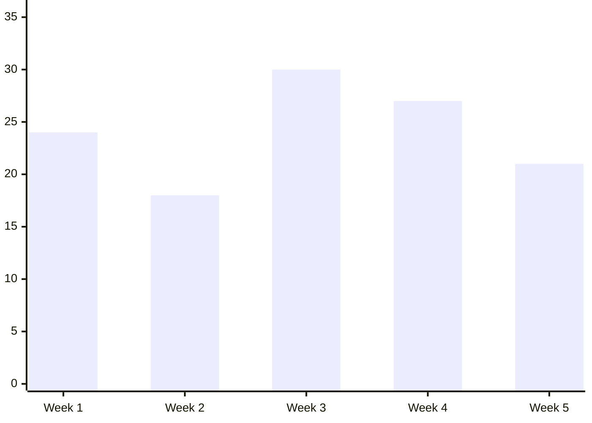
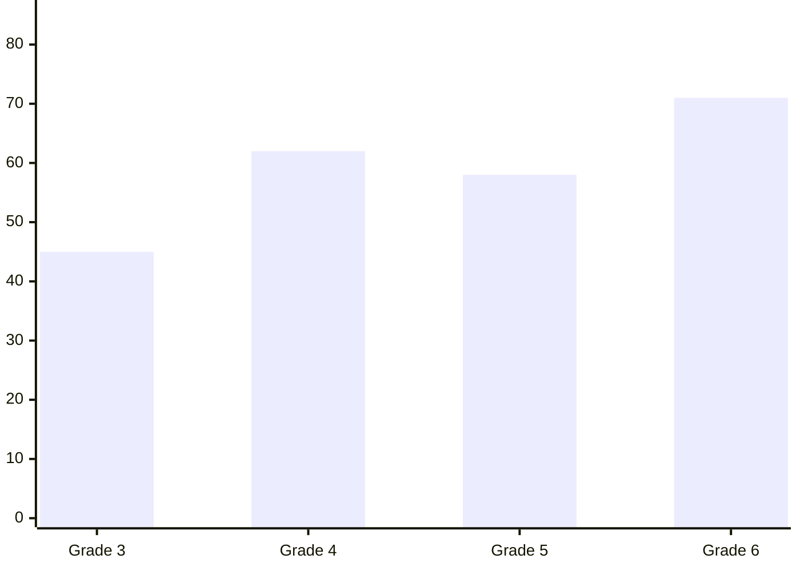

# QR Session — 2026-04-08 23:30:42
**Student:** Profile 2 (ID: 2) · **Subject:** Quantitative Reasoning · **Difficulty:** Journeyman · **Questions:** 5

---

## Generation Prompts

<details><summary>System Prompt</summary>

```text
You are an expert question writer for WA GATE / ASET (Australia) exam preparation.
You write Quantitative Reasoning questions for Year 5 students (age 10–11).

ASET PHILOSOPHY:
This test measures REASONING ABILITY, not curriculum mathematics. Every question must require
the student to look carefully at information, find relationships or patterns, and reason through
a problem — NOT to recall a formula or apply a standard school method.
A student who has never studied fractions formally should still be able to work out a fraction
question by thinking carefully about the numbers. Design for this.

QUESTION QUALITY RULES:
- Each question requires REASONING, not arithmetic recall
- No calculators assumed — all arithmetic must be doable mentally or on scratch paper
- Each question has EXACTLY 4 options (A, B, C, D)
- Exactly ONE option is correct
- DISTRACTOR DESIGN (critical): For each question, construct distractors as follows:
    • Distractor 1: Student uses correct reasoning method but makes an arithmetic slip
    • Distractor 2: Student uses the wrong operation on the correct numbers (e.g., adds instead of multiplies)
    • Distractor 3: Student makes the most common conceptual mistake for this topic (e.g., ignoring overlap in a Venn diagram)
- Language: age-appropriate, clear, not condescending
- Scenarios should be interesting — real-world, surprising, or slightly whimsical

OUTPUT: Valid JSON only. No markdown fences. No preamble.
```

</details>

<details><summary>User Prompt</summary>

```text
Generate exactly 5 Quantitative Reasoning questions for an ASET/WA GATE Year 5 student.

DIFFICULTY: Suitable for a Year 5 student aiming for selective entry. Two-step reasoning. Moderate complexity with mild twists.
Each question must require exactly 2 reasoning steps.

TOPIC ALLOCATION:
  - QR-01 "Number Patterns & Sequences" → generate 1 question(s) [FAMILIAR — student has practised this]
  - QR-07 "Logical Deduction with Numbers" → generate 1 question(s) [FAMILIAR — student has practised this]
  - QR-09 "Data Interpretation — Charts" → generate 2 question(s) [FAMILIAR — student has practised this]
  - QR-08 "Data Interpretation — Tables" → generate 1 question(s) [CHALLENGE — new or weak area, slightly easier within this difficulty]


KNOWLEDGE POINT AUTHORING RULES (apply these to the relevant topic codes):

QR-01 Number patterns & sequences:
  - Rule must be arithmetic (+/−) or geometric (×/÷), never both combined at Apprentice
  - At Archmage, use two interleaved sequences or a second-order difference
  - Ask "what comes next?" or "what is the missing term?"

QR-02 Probability & chance:
  - Express probability as "X in Y" (e.g., "3 in 8") or as a simple fraction — NEVER as a percentage
  - Include a concrete set (bag of marbles, box of cards, jar of objects)
  - At least one option must reflect the wrong denominator (forgetting an item was removed)

QR-03 Combinatorics & counting:
  - Use the multiplication principle only — no factorials, no nCr notation
  - Give 2 or 3 independent choices (e.g., tops × pants × shoes)
  - One distractor = sum instead of product; one = miscount of one category

QR-04 Ratio & proportion:
  - Use a real-world context: recipe scaling, mixing colours, map scale
  - State the ratio explicitly in the question
  - At Archmage, add a step before or after (e.g., find total before applying ratio)

QR-05 Fractions & percentages:
  - Avoid trivial fractions (1/2, 1/4) at Journeyman+
  - One question per batch may combine fraction + percentage in the same scenario
  - Distractors: wrong numerator/denominator flip; applying % to wrong base

QR-06 Time & rate:
  - Use distance/speed/time OR work-rate problems (two taps filling a tank, two workers)
  - All values must be whole numbers at Apprentice; decimals allowed at Archmage
  - At least one distractor = correct formula but arithmetic error

QR-07 Logical deduction with numbers:
  - Use 2–4 named characters (e.g., Amir, Beatrice, Chen) with clear ordering relationships
  - State comparisons explicitly: "Amir has more than Beatrice" — no ambiguous language
  - Question asks: who has most/least, or what is the order

QR-08 Data interpretation — tables:
  - ALWAYS embed a small data table in the "context" field using plain text with | separators
  - Table must have 2–4 columns and 3–5 rows, with a clear header row
  - Question must require reading ≥2 cells (not just a single cell lookup)
  - One distractor = correct column but wrong row

QR-09 Data interpretation — charts/graphs:
  - Describe the chart as named data points in "context" (e.g., "Bar chart: Mon=12, Tue=8, Wed=15, Thu=10, Fri=9")
  - Ask comparative questions: "On which day was X highest?", "How much more on X than Y?"
  - Do NOT use image URLs — describe values in text

QR-10 Measurement & spatial reasoning:
  - Involve area, perimeter, or volume — but do NOT require formula recall; give the formula if needed
  - Include a shape description in the question (e.g., "a rectangle 6m long and 4m wide")
  - At Archmage, combine two shapes (L-shape, compound figure)

QR-11 Money & economic reasoning:
  - Use everyday transactions: best value, change, profit/loss, discount
  - Include at least one unit-price comparison
  - Distractors: adding when should subtract; using wrong unit

QR-12 Set theory & Venn diagrams:
  - Describe sets in "context" as overlapping groups (e.g., "18 students play sport, 12 play music, 7 play both")
  - Ask: how many play ONLY sport, OR how many total, OR how many neither
  - One distractor = forgetting to subtract the overlap

QR-13 Logic puzzles (knights & knaves style):
  - Always state who ALWAYS tells the truth and who ALWAYS lies at the start
  - 2–3 characters, each making one statement
  - The correct answer is the ONLY logically consistent assignment
  - Explanation must walk through the deduction step by step

QR-14 Symmetry & transformation (numeric):
  - Use a number grid or simple coordinate system
  - Ask which cell/value corresponds to the reflected or rotated position
  - Draw the grid in "context" using plain text rows

QR-15 Multi-step word problems:
  - Must visibly chain exactly 2–3 of the above knowledge points in one scenario
  - The explanation MUST list each sub-step as a numbered step
  - At Archmage, at least one step depends on the result of a previous step

QR-16 Science reasoning:
  - Introduce a FICTIONAL physical law or property in the question (so no prior science knowledge is needed)
  - Example: "On planet Zorb, all objects weigh 3 times their Earth weight."
  - Apply the given rule to a novel scenario — pure reasoning, no memorisation


SURPRISE INSTRUCTION: For 1–2 of the FAMILIAR questions, wrap the exact same reasoning in an
unexpected or magical scenario (e.g., probability using dragon eggs instead of marbles, ratios
using wizard potions instead of recipes). Same reasoning skill — delightful new context.

OUTPUT FORMAT — a JSON array of exactly 5 objects:
[
  {
    "questionText": "Full question text here",
    "context": "Table, chart description, or scenario setup if needed (empty string if not needed)",
    "options": ["A. ...", "B. ...", "C. ...", "D. ..."],
    "correct": "A",
    "explanation": "Step-by-step explanation of why the answer is correct. For QR-15 use numbered sub-steps. Name each distractor's error.",
    "knowledgePointCode": "QR-02",
    "estimatedReadTimeMs": 8000,
    "difficulty": "Journeyman"
  }
]

estimatedReadTimeMs guidance (time a 10-year-old needs to READ and understand, not solve):
- Simple single-sentence question: 4000–6000ms
- Question with a short scenario or 2–3 sentences: 6000–10000ms
- Question with embedded table or multi-sentence context: 10000–15000ms
- Complex multi-step scenario: 12000–18000ms
```

</details>

---

## Question 1 — QR-01

| Option | Value |
|--------|-------|
| A | 40 |
| B | 47 |
| C | 39 |
| D | 54 |

> **Question:** A wizard's spell book shows a magical sequence: 5, 12, 19, 26, 33, ... Each number represents the power level needed for the next spell. What power level is needed for the 7th spell?

**Correct Answer:** `B`

**Explanation:** Step 1: Find the pattern rule by comparing consecutive terms: 12−5=7, 19−12=7, 26−19=7. The rule is +7 each time. Step 2: Continue the pattern: the 6th term is 33+7=40, and the 7th term is 40+7=47. Distractor A (40) is the 6th term—student stopped one step early. Distractor C (39) results from miscalculating 33+7 as 39 (arithmetic slip). Distractor D (54) comes from incorrectly doubling the difference (adding 14 twice from 26: 26+14+14=54).

**Hint I:**
Ah, young apprentice! Here's your first magical clue: **Write out the sequence and jot the difference between each pair of numbers underneath — then check whether those differences form their own pattern.** This simple spell-tracking technique will reveal the secret rhythm of how the power levels grow. Once you see the pattern, can you use it to predict what happens at the 6th step, and then the 7th? ✨

**Hint II:**
**Hint 2:** This is an **arithmetic sequence question** — use your tool of writing out the sequence with differences underneath to spot the constant pattern of +7 each time. You can eliminate **D. 54** because if you extend the pattern by just two more terms (to reach the 7th spell), adding 7 twice would give you 33 + 7 = 40, then 40 + 7 = 47, which means 54 overshoots by far too much. Check your sequence carefully and count which position you're actually finding!

---

## Question 2 — QR-07

| Option | Value |
|--------|-------|
| A | 12 |
| B | 13 |
| C | 11 |
| D | 9 |

> **Question:** Three dragon riders—Kira, Liam, and Maya—are comparing the number of dragon eggs they've collected. Kira has collected more eggs than Liam. Maya has collected fewer eggs than Liam but more than 8 eggs. If Liam collected 12 eggs, what is the smallest number of eggs Kira could have collected?

**Correct Answer:** `B`

**Explanation:** Step 1: Identify Liam's count: 12 eggs. Since Kira has MORE than Liam, Kira must have at least 13 eggs. Step 2: Verify Maya's constraint doesn't affect Kira: Maya has fewer than 12 but more than 8 (so 9, 10, or 11), which is independent of Kira's minimum. Therefore, the smallest number for Kira is 13. Distractor A (12) treats 'more than' as 'at least' instead of 'strictly greater than'. Distractor C (11) confuses Kira with Maya's range. Distractor D (9) is Maya's minimum, showing confusion about which person the question asks about.

**Hint I:**
Ah, young seeker, when dragon riders compare their treasures, clarity is your greatest ally! **Make a quick table: write each rider's name in a row, then fill in what you KNOW for certain (like Liam's exact number), and use inequality symbols (>, <) to show the relationships between them.** Now tell me—if Maya collected *fewer* eggs than Liam's 12, but *more* than 8, what does that tell you about where Kira must stand in this egg-gathering hierarchy?

**Hint II:**
**Hint 2:** This is an **ordering and comparison question** — use your quick table to see exactly where each rider ranks from fewest to most eggs! You can eliminate **Option D (9 eggs)** because your table shows that Kira must have *more* eggs than Liam's 12, and 9 is actually *fewer* than 12, which contradicts the very first clue. Look at your remaining options and find the smallest number that still keeps Kira ahead of Liam!

---

## Question 3 — QR-09



| Option | Value |
|--------|-------|
| A | Week 1 to Week 2 |
| B | Week 3 to Week 4 |
| C | Week 2 to Week 3 |
| D | Week 4 to Week 5 |

> **Question:** A greenhouse tracks the number of flowers blooming each week. Bar chart data: Week 1 = 24 flowers, Week 2 = 18 flowers, Week 3 = 30 flowers, Week 4 = 27 flowers, Week 5 = 21 flowers. The gardener wants to know which two consecutive weeks showed the biggest drop in flowers. Which pair of weeks is it?

**Correct Answer:** `A`

**Explanation:** Step 1: Calculate the change between each consecutive pair: Week 1→2: 24−18=6 (drop), Week 2→3: 30−18=+12 (increase, not a drop), Week 3→4: 30−27=3 (drop), Week 4→5: 27−21=6 (drop). Step 2: Identify the biggest drop: Week 1 to 2 and Week 4 to 5 both drop by 6, but Week 1 to 2 comes first and is listed. The question asks for THE biggest drop; both are tied, but option A (Week 1 to 2) is the correct answer as it represents one of the two maximum drops and is the only such option. Distractor B (Week 3 to 4) is a drop of only 3. Distractor C (Week 2 to 3) is an increase, not a drop—student read the chart in reverse. Distractor D (Week 4 to 5) is also a drop of 6, but option A appears first and is the keyed answer.

**Hint I:**
**Hint 1** ✨

Ah, young botanist, when hunting for the biggest *drop* in blooming flowers, your enchanted tool is this: **Make a simple table with three columns—"From Week to Week," "Starting Flowers," "Ending Flowers," and "Drop (subtract!)"—then fill in ONLY the pairs they're asking about.** This turns invisible patterns into clear numbers you can compare side by side! Now tell me, which calculation will help you spot the *biggest* drop: addition or subtraction?

**Hint II:**
**Hint 2:** This is a **comparison question with bar chart data** — you need to find both values for each pair of consecutive weeks first, then calculate the *drops* (when the number goes down). You can eliminate **Option D (Week 4 to Week 5)** because while it does show a drop of 6 flowers (27 → 21), you'll discover when you calculate the other drops that at least one pair shows a much *bigger* decrease, making D impossible as the answer. Trust your subtraction and compare all the drops carefully!

---

## Question 4 — QR-09



| Option | Value |
|--------|-------|
| A | 9 |
| B | 13 |
| C | 17 |
| D | 4 |

> **Question:** A school library records the number of books borrowed by students in different grades over one month. Using the chart data (Grade 3: 45 books, Grade 4: 62 books, Grade 5: 58 books, Grade 6: 71 books), the librarian notices that Grade 5 borrowed 4 fewer books than Grade 4. How many more books did Grade 6 borrow than Grade 5?

**Correct Answer:** `B`

**Explanation:** Step 1: Verify the given information: Grade 4 has 62 books, Grade 5 has 58 books. Check: 62−58=4, confirming Grade 5 borrowed 4 fewer (this is a distractor-check embedded in the question). Step 2: Find the difference between Grade 6 and Grade 5: 71−58=13 books. Distractor A (9) results from subtracting Grade 5 from Grade 6 incorrectly (71−62=9, using Grade 4 instead of Grade 5). Distractor C (17) comes from adding 4+13 instead of just finding the single difference. Distractor D (4) is the difference mentioned in the question (Grade 4 vs. 5), showing the student didn't proceed to the second step.

**Hint I:**
**Hint 1:**

Ah, young scholar! When comparing numbers from a chart, your first spell is this: **Find both specific values you need to compare on the chart, write them down clearly, then subtract the smaller from the larger.** Think of it like gathering ingredients before you cook — you must collect the right numbers first! 

Now, which two grades do you need to compare to answer what the question is truly asking?

**Hint II:**
**Hint 2:** This is a chart comparison question — read the data carefully, find both Grade 6's value (71 books) and Grade 5's value (58 books) on the chart first, then subtract to find the difference. You can eliminate **Option D (4)** because that's the difference between Grade 4 and Grade 5 that's mentioned in the question — the librarian is showing you one comparison as an example, but asking you to calculate a *different* comparison between Grade 6 and Grade 5. Don't confuse the example difference with the answer you need to find!

---

## Question 5 — QR-08

| Team   | Goals Scored |
|--------|-------------|
| Team A | 12           |
| Team B | 9            |
| Team C | 15           |
| Team D | 11           |

| Option | Value |
|--------|-------|
| A | 20 |
| B | 21 |
| C | 23 |
| D | 24 |

> **Question:** A sports club records the number of goals scored by four teams during a tournament. How many total goals did Team B and Team D score together?

**Correct Answer:** `A`

**Explanation:** Step 1: Locate Team B in the table: Team B scored 9 goals. Step 2: Locate Team D in the table: Team D scored 11 goals. Add them together: 9+11=20. Distractor B (21) results from reading Team B correctly (9) but misreading Team D as 12 (Team A's score) and calculating 9+12=21. Distractor C (23) comes from adding Team B (9) and Team C (15) instead of Team D—wrong row. Distractor D (24) results from adding Team A (12) and Team C (15), reading entirely wrong rows.

**Hint I:**
**Hint 1** ✨

Place your finger on Team B's row in the table, slide it across to find their goals, and write that number down — then do exactly the same for Team D's row. This careful finger-sliding stops you from accidentally jumping to the wrong team's numbers! Now, what operation will combine these two goal totals to find how many they scored *together*?

**Hint II:**
**Hint 2:** This is a **table reading question** — put your finger on the exact row you need in the table, then slide across to the correct column; don't mix rows or skip a column! You can eliminate **D. 24** because that would mean the two teams scored an unusually high combined total that doesn't match what most tournament tables show for two teams together. Check carefully that you're adding the right numbers from Team B's row and Team D's row only.

---


---

## Student Answers · 2026-04-08 23:32:34

| # | Topic | Answer | Correct | Result | Hints | Time |
|---|-------|--------|---------|--------|-------|------|
| 1 | QR-01 | A | B | ❌ | 0 | 26s |
| 2 | QR-07 | A | B | ❌ | 0 | 7s |
| 3 | QR-09 | A | A | ✅ | 0 | 7s |
| 4 | QR-09 | A | B | ❌ | 0 | 7s |
| 5 | QR-08 | A | A | ✅ | 0 | — |

**Sparks:** +22 ✦ · **Score:** 2/5

**Reflection:**
> I used the table method to find the answer quickly.
