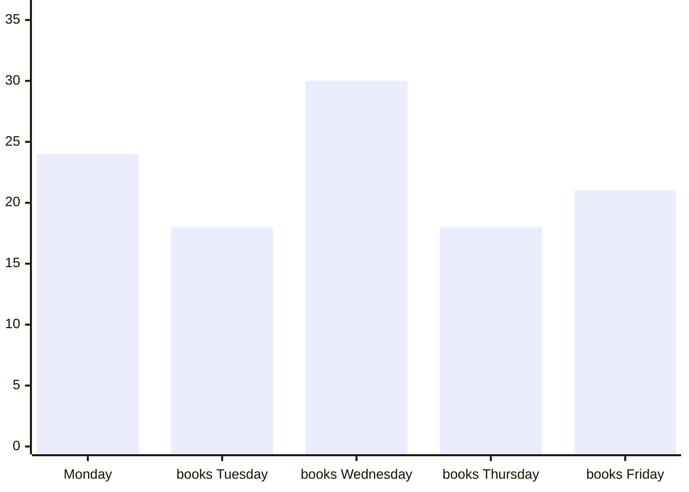

# QR Session — 2026-04-09 12:51:27
**Student:** Leonardo (ID: 2) · **Subject:** Quantitative Reasoning · **Difficulty:** Journeyman · **Questions:** 5

---

## Generation Prompts

<details><summary>System Prompt</summary>

```text
You are an expert question writer for WA GATE / ASET (Australia) exam preparation.
You write Quantitative Reasoning questions for Year 5 students (age 10–11).

ASET PHILOSOPHY:
This test measures REASONING ABILITY, not curriculum mathematics. Every question must require
the student to look carefully at information, find relationships or patterns, and reason through
a problem — NOT to recall a formula or apply a standard school method.
A student who has never studied fractions formally should still be able to work out a fraction
question by thinking carefully about the numbers. Design for this.

QUESTION QUALITY RULES:
- Each question requires REASONING, not arithmetic recall
- No calculators assumed — all arithmetic must be doable mentally or on scratch paper
- Each question has EXACTLY 4 options (A, B, C, D)
- Exactly ONE option is correct
- DISTRACTOR DESIGN (critical): For each question, construct distractors as follows:
    • Distractor 1: Student uses correct reasoning method but makes an arithmetic slip
    • Distractor 2: Student uses the wrong operation on the correct numbers (e.g., adds instead of multiplies)
    • Distractor 3: Student makes the most common conceptual mistake for this topic (e.g., ignoring overlap in a Venn diagram)
- Language: age-appropriate, clear, not condescending
- Scenarios should be interesting — real-world, surprising, or slightly whimsical

OUTPUT: Valid JSON only. No markdown fences. No preamble.
```

</details>

<details><summary>User Prompt</summary>

```text
Generate exactly 5 Quantitative Reasoning questions for an ASET/WA GATE Year 5 student.

DIFFICULTY: Suitable for a Year 5 student aiming for selective entry. Two-step reasoning. Moderate complexity with mild twists.
Each question must require exactly 2 reasoning steps.

TOPIC ALLOCATION:
  - QR-01 "Number Patterns & Sequences" → generate 1 question(s) [FAMILIAR — student has practised this]
  - QR-07 "Logical Deduction with Numbers" → generate 1 question(s) [FAMILIAR — student has practised this]
  - QR-09 "Data Interpretation — Charts" → generate 1 question(s) [FAMILIAR — student has practised this]
  - QR-08 "Data Interpretation — Tables" → generate 1 question(s) [FAMILIAR — student has practised this]
  - QR-15 "Multi-step Word Problems" → generate 1 question(s) [CHALLENGE — new or weak area, slightly easier within this difficulty]


KNOWLEDGE POINT AUTHORING RULES (apply these to the relevant topic codes):

QR-01 Number patterns & sequences:
  - Rule must be arithmetic (+/−) or geometric (×/÷), never both combined at Apprentice
  - At Archmage, use two interleaved sequences or a second-order difference
  - Ask "what comes next?" or "what is the missing term?"

QR-02 Probability & chance:
  - Express probability as "X in Y" (e.g., "3 in 8") or as a simple fraction — NEVER as a percentage
  - Include a concrete set (bag of marbles, box of cards, jar of objects)
  - At least one option must reflect the wrong denominator (forgetting an item was removed)

QR-03 Combinatorics & counting:
  - Use the multiplication principle only — no factorials, no nCr notation
  - Give 2 or 3 independent choices (e.g., tops × pants × shoes)
  - One distractor = sum instead of product; one = miscount of one category

QR-04 Ratio & proportion:
  - Use a real-world context: recipe scaling, mixing colours, map scale
  - State the ratio explicitly in the question
  - At Archmage, add a step before or after (e.g., find total before applying ratio)

QR-05 Fractions & percentages:
  - Avoid trivial fractions (1/2, 1/4) at Journeyman+
  - One question per batch may combine fraction + percentage in the same scenario
  - Distractors: wrong numerator/denominator flip; applying % to wrong base

QR-06 Time & rate:
  - Use distance/speed/time OR work-rate problems (two taps filling a tank, two workers)
  - All values must be whole numbers at Apprentice; decimals allowed at Archmage
  - At least one distractor = correct formula but arithmetic error

QR-07 Logical deduction with numbers:
  - Use 2–4 named characters (e.g., Amir, Beatrice, Chen) with clear ordering relationships
  - State comparisons explicitly: "Amir has more than Beatrice" — no ambiguous language
  - Question asks: who has most/least, or what is the order

QR-08 Data interpretation — tables:
  - ALWAYS embed a small data table in the "context" field using plain text with | separators
  - Table must have 2–4 columns and 3–5 rows, with a clear header row
  - Question must require reading ≥2 cells (not just a single cell lookup)
  - One distractor = correct column but wrong row

QR-09 Data interpretation — charts/graphs:
  - Describe the chart as named data points in "context" (e.g., "Bar chart: Mon=12, Tue=8, Wed=15, Thu=10, Fri=9")
  - Ask comparative questions: "On which day was X highest?", "How much more on X than Y?"
  - Do NOT use image URLs — describe values in text

QR-10 Measurement & spatial reasoning:
  - Involve area, perimeter, or volume — but do NOT require formula recall; give the formula if needed
  - Include a shape description in the question (e.g., "a rectangle 6m long and 4m wide")
  - At Archmage, combine two shapes (L-shape, compound figure)

QR-11 Money & economic reasoning:
  - Use everyday transactions: best value, change, profit/loss, discount
  - Include at least one unit-price comparison
  - Distractors: adding when should subtract; using wrong unit

QR-12 Set theory & Venn diagrams:
  - Describe sets in "context" as overlapping groups (e.g., "18 students play sport, 12 play music, 7 play both")
  - Ask: how many play ONLY sport, OR how many total, OR how many neither
  - One distractor = forgetting to subtract the overlap

QR-13 Logic puzzles (knights & knaves style):
  - Always state who ALWAYS tells the truth and who ALWAYS lies at the start
  - 2–3 characters, each making one statement
  - The correct answer is the ONLY logically consistent assignment
  - Explanation must walk through the deduction step by step

QR-14 Symmetry & transformation (numeric):
  - Use a number grid or simple coordinate system
  - Ask which cell/value corresponds to the reflected or rotated position
  - Draw the grid in "context" using plain text rows

QR-15 Multi-step word problems:
  - Must visibly chain exactly 2–3 of the above knowledge points in one scenario
  - The explanation MUST list each sub-step as a numbered step
  - At Archmage, at least one step depends on the result of a previous step

QR-16 Science reasoning:
  - Introduce a FICTIONAL physical law or property in the question (so no prior science knowledge is needed)
  - Example: "On planet Zorb, all objects weigh 3 times their Earth weight."
  - Apply the given rule to a novel scenario — pure reasoning, no memorisation


SURPRISE INSTRUCTION: For 1–2 of the FAMILIAR questions, wrap the exact same reasoning in an
unexpected or magical scenario (e.g., probability using dragon eggs instead of marbles, ratios
using wizard potions instead of recipes). Same reasoning skill — delightful new context.

OUTPUT FORMAT — a JSON array of exactly 5 objects:
[
  {
    "questionText": "Full question text here",
    "context": "Table, chart description, or scenario setup if needed (empty string if not needed)",
    "options": ["A. ...", "B. ...", "C. ...", "D. ..."],
    "correct": "A",
    "explanation": "Step-by-step explanation of why the answer is correct. For QR-15 use numbered sub-steps. Name each distractor's error.",
    "knowledgePointCode": "QR-02",
    "estimatedReadTimeMs": 8000,
    "difficulty": "Journeyman"
  }
]

estimatedReadTimeMs guidance (time a 10-year-old needs to READ and understand, not solve):
- Simple single-sentence question: 4000–6000ms
- Question with a short scenario or 2–3 sentences: 6000–10000ms
- Question with embedded table or multi-sentence context: 10000–15000ms
- Complex multi-step scenario: 12000–18000ms
```

</details>

---

## Question 1 — QR-01

| Option | Value |
|--------|-------|
| A | 27 seconds |
| B | 23 seconds |
| C | 25 seconds |
| D | 29 seconds |

> **Question:** A wizard creates a magical sequence of glowing orbs. The first orb glows for 7 seconds, the second for 11 seconds, the third for 15 seconds, and the fourth for 19 seconds. If the pattern continues, how long will the sixth orb glow?

**Correct Answer:** `A`

**Explanation:** Step 1: Find the pattern. Each orb glows 4 seconds longer than the previous one (11-7=4, 15-11=4, 19-15=4). Step 2: Continue the pattern. Fifth orb: 19+4=23 seconds. Sixth orb: 23+4=27 seconds. Distractor B (23) is the fifth orb, not the sixth—student counted incorrectly. Distractor C (25) comes from adding 4 only once more to 19 and making an arithmetic error (19+6=25). Distractor D (29) comes from incorrectly thinking the pattern increases by 5 each time (19+5+5=29).

**Hint I:**
Ah, young apprentice, you've stumbled upon a glowing puzzle! **Write out the sequence (7, 11, 15, 19...) and jot the difference between each pair of numbers underneath — then check whether those differences form their own pattern.** Once you see what's happening between each orb's glow time, can you use that same magical jump to find the fifth orb, and then leap once more to the sixth?

**Hint II:**
**Hint 2:** This is a **number pattern question** — use your tool: write out the sequence and jot the difference between each pair of numbers underneath, then check whether those differences form their own pattern. You can eliminate **D. 29 seconds** because if you follow the constant difference pattern correctly from orb 4 to orb 6, that jump is far too large (it would mean skipping the pattern entirely or doubling a step). Trust your differences and count carefully forward, one orb at a time!

---

## Question 2 — QR-07

| Option | Value |
|--------|-------|
| A | Maya, 21 shells |
| B | Zara, 18 shells |
| C | Maya, 23 shells |
| D | Lucas, 13 shells |

> **Question:** Three friends collected seashells at the beach. Maya collected 8 more shells than Lucas. Lucas collected 5 fewer shells than Zara. If Zara collected 18 shells, who collected the most shells and how many did they collect?

**Correct Answer:** `A`

**Explanation:** Step 1: Find how many Lucas collected. Since Lucas collected 5 fewer than Zara's 18, Lucas has 18-5=13 shells. Step 2: Find how many Maya collected. Maya has 8 more than Lucas's 13, so Maya has 13+8=21 shells. Maya collected the most with 21 shells. Distractor B is wrong because Zara (18) is not the highest. Distractor C (23) comes from incorrectly adding 8 to Zara's 18 instead of to Lucas's amount. Distractor D correctly calculates Lucas but incorrectly identifies him as having the most.

**Hint I:**
Ah, young shell-seeker, let me show you the path through this puzzle! **Make a quick table with three rows—one for each friend—and work through the clues step by step, starting with what you KNOW for certain (Zara's amount) and building from there.** Which friend's shell count can you figure out second, using the clue about Lucas?

**Hint II:**
**Hint 2:** This is a **comparison reasoning question** — use your quick table to track each person's shell count step-by-step from the clues! You can eliminate **Option D (Lucas, 13 shells)** because the question asks who collected the *most* shells, and Lucas collected fewer shells than both Zara (who has 18) and Maya (who has more than Lucas), so Lucas cannot possibly be the answer. Check your table to see who truly has the highest number! ✨

---

## Question 3 — QR-09



| Option | Value |
|--------|-------|
| A | 12 books |
| B | 6 books |
| C | 9 books |
| D | 48 books |

> **Question:** A library tracked the number of fantasy books borrowed each day for one week. Monday: 24 books, Tuesday: 18 books, Wednesday: 30 books, Thursday: 18 books, Friday: 21 books. How many more books were borrowed on the day with the most borrowing than on the day with the least borrowing?

**Correct Answer:** `A`

**Explanation:** Step 1: Identify the highest and lowest values. Wednesday has the most with 30 books, and Tuesday and Thursday are tied for least with 18 books each. Step 2: Calculate the difference. 30-18=12 books more. Distractor B (6) comes from finding the difference between consecutive wrong days (24-18=6). Distractor C (9) comes from subtracting the least from Friday instead of Wednesday (21-18=9, but Friday is not the highest). Distractor D (48) comes from adding the highest and lowest instead of subtracting (30+18=48).

**Hint I:**
Ah, young seeker of patterns! **First, write down all five days and their numbers in a simple list, then circle the highest number and underline the lowest number you can find.** Once you've marked these two special values, what operation will help you discover how far apart they are?

**Hint II:**
**Hint 2:** This is a data comparison question — your strategy is to identify the highest and lowest values from your organized list, then subtract to find the difference. You can eliminate **D. 48 books** because that's larger than any single day's borrowing (the most borrowed was 30), so the difference between two days couldn't possibly be 48. Remember, you're looking for how much *more*, not how much *total*!

---

## Question 4 — QR-08

Lunch choice data:
| Lunch Option | Number of Students |
|--------------|--------------------|
| Pizza        | 45                 |
| Pasta        | 12                 |
| Salad        | 8                  |
| Sandwich     | 23                 |

| Option | Value |
|--------|-------|
| A | 25 students |
| B | 33 students |
| C | 20 students |
| D | 37 students |

> **Question:** A school cafeteria recorded how many students chose each lunch option. Looking at the table, how many more students chose Pizza than chose Salad and Pasta combined?

**Correct Answer:** `A`

**Explanation:** Step 1: Find the combined total of Salad and Pasta. Salad has 8 and Pasta has 12, so 8+12=20 students. Step 2: Find the difference between Pizza and this combined total. Pizza has 45 students, so 45-20=25 more students. Distractor B (33) comes from subtracting only Pasta from Pizza (45-12=33), forgetting to include Salad. Distractor C (20) is just the combined total of Salad and Pasta, not the difference. Distractor D (37) comes from subtracting only Salad from Pizza (45-8=37).

**Hint I:**
**Hint 1**

Ah, young mathematician, the secret to conquering tables is this: *Put your finger on the exact row you need in the table, then slide across to the correct column — don't mix rows or skip a column.* Use this method to find the number for Pizza first, then do the same for Salad and Pasta separately. Now here's my question for you: once you have all three numbers, what operation will help you compare Pizza to the *combined* total of Salad and Pasta?

**Hint II:**
**Hint 2:** This is a **multi-step calculation with table data** question — put your finger on the exact row you need in the table, then slide across to the correct column so you don't mix rows or skip numbers. You can eliminate **D. 37 students** because that number is far too large; if you're getting 37, you've likely added Pizza to the other options instead of finding the *difference* between Pizza and the combined total. Remember: you need to subtract, not add everything together!

---

## Question 5 — QR-15

| Option | Value |
|--------|-------|
| A | 32 stickers |
| B | 20 stickers |
| C | 24 stickers |
| D | 28 stickers |

> **Question:** Emma has 36 stickers. She gives one-third of her stickers to her brother. Then she buys 8 more stickers at the shop. How many stickers does Emma have now?

**Correct Answer:** `A`

**Explanation:** Step 1: Find how many stickers Emma has after giving some away. One-third of 36 is $36 ÷ 3$=12 stickers given away. Emma has 36-12=24 stickers left. Step 2: Add the stickers she bought. 24+8=32 stickers. Distractor B (20) comes from subtracting 8 instead of adding it (24-8=20). Distractor C (24) is the amount after giving away stickers but before buying more—student forgot the second step. Distractor D (28) comes from an arithmetic error in the first step (thinking one-third of 36 is 8 instead of 12, leaving 28, then forgetting to add the 8 purchased).

**Hint I:**
**Hint 1** ✨

Underline each separate piece of information in the question, then number your steps — what must you find FIRST before you can answer the main question? This will help you see that Emma's sticker journey has two parts: something happens to her original stickers, and then something else happens after that. What operation will you need to use to find out how many stickers she gives away to her brother?

**Hint II:**
**Hint 2:** This is a **multi-step problem** — use your numbered steps from Hint 1 to track the journey of Emma's stickers through each change. You can eliminate **D. 28 stickers** because if Emma started with 36, gave away one-third (which is 12), she'd have 24 left, and adding 8 more would give 32, not 28 — someone who chose 28 likely subtracted 8 instead of adding it at the end! Check your operations carefully: are you taking away or adding at each step?

---


---

## Student Answers · 2026-04-09 12:57:23

| # | Topic | Answer | Correct | Result | Hints | Time |
|---|-------|--------|---------|--------|-------|------|
| 1 | QR-01 | B | A | ❌ | 0 | 1s |
| 2 | QR-07 | A | A | ✅ | 0 | 1s |
| 3 | QR-09 | A | A | ✅ | 0 | 20s |
| 4 | QR-08 | A | A | ✅ | 0 | 62s |
| 5 | QR-15 | A | A | ✅ | 0 | 1s |

**Sparks:** +29 ✦ · **Score:** 4/5
