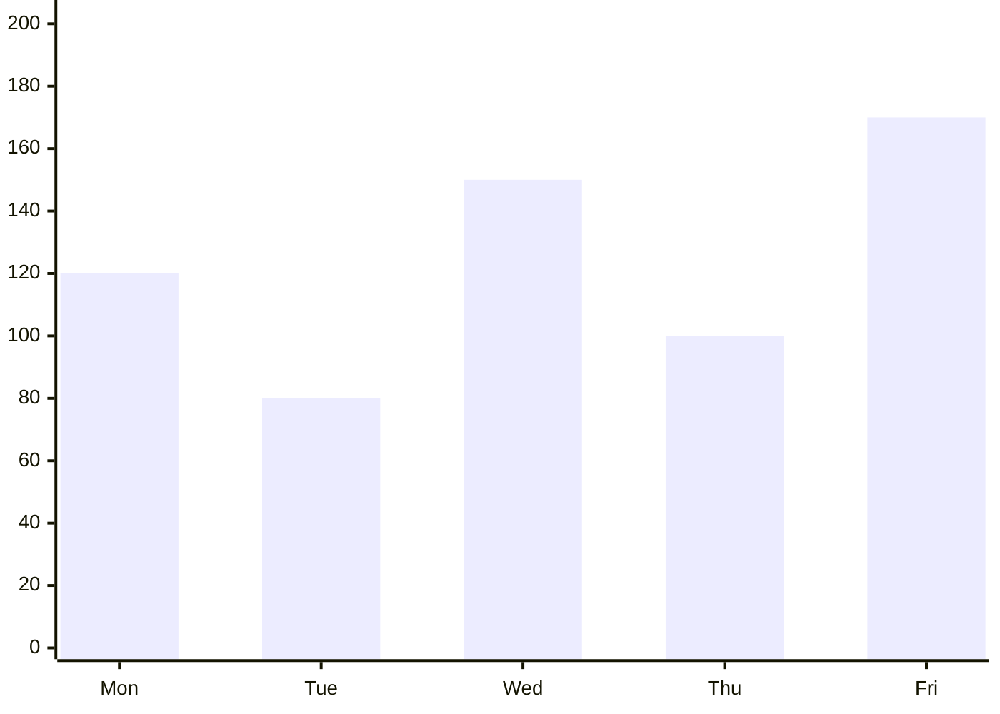

# QR Session — 2026-04-11 13:16:04
**Student:** Leonardo (ID: 2) · **Subject:** Quantitative Reasoning · **Difficulty:** Archmage · **Questions:** 5

---

## Generation Prompts

<details><summary>System Prompt</summary>

```text
You are an expert question writer for WA GATE / ASET (Australia) exam preparation.
You write Quantitative Reasoning questions for Year 5 students (age 10–11).

ASET PHILOSOPHY:
This test measures REASONING ABILITY, not curriculum mathematics. Every question must require
the student to look carefully at information, find relationships or patterns, and reason through
a problem — NOT to recall a formula or apply a standard school method.
A student who has never studied fractions formally should still be able to work out a fraction
question by thinking carefully about the numbers. Design for this.

QUESTION QUALITY RULES:
- Each question requires REASONING, not arithmetic recall
- No calculators assumed — all arithmetic must be doable mentally or on scratch paper
- Each question has EXACTLY 4 options (A, B, C, D)
- Exactly ONE option is correct
- DISTRACTOR DESIGN (critical): For each question, construct distractors as follows:
    • Distractor 1: Student uses correct reasoning method but makes an arithmetic slip
    • Distractor 2: Student uses the wrong operation on the correct numbers (e.g., adds instead of multiplies)
    • Distractor 3: Student makes the most common conceptual mistake for this topic (e.g., ignoring overlap in a Venn diagram)
- Language: age-appropriate, clear, not condescending
- Scenarios should be interesting — real-world, surprising, or slightly whimsical

OUTPUT: Valid JSON only. No markdown fences. No preamble.
```

</details>

<details><summary>User Prompt</summary>

```text
Generate exactly 5 Quantitative Reasoning questions for an ASET/WA GATE Year 5 student.

DIFFICULTY: Suitable for top-performing Year 5 preparing for GATE/ASET. Three or more reasoning steps. Tricky distractors that catch common errors.
Each question must require 3 or more reasoning steps, with at least one non-obvious sub-step.

TOPIC ALLOCATION:
  - QR-01 "Number Patterns & Sequences" → generate 1 question(s) [FAMILIAR — student has practised this]
  - QR-07 "Logical Deduction with Numbers" → generate 1 question(s) [FAMILIAR — student has practised this]
  - QR-08 "Data Interpretation — Tables" → generate 1 question(s) [FAMILIAR — student has practised this]
  - QR-09 "Data Interpretation — Charts" → generate 1 question(s) [FAMILIAR — student has practised this]
  - QR-02 "Probability & Chance" → generate 1 question(s) [CHALLENGE — new or weak area, slightly easier within this difficulty]


KNOWLEDGE POINT AUTHORING RULES (apply these to the relevant topic codes):

QR-01 Number patterns & sequences:
  Six subtypes — choose the right one for the difficulty level:
  1. Ascending (up): small gaps → try addition; large gaps → try multiplication
  2. Descending (down): small gaps → try subtraction; large gaps → try division
  3. Combination: alternating up/down — split odd-position and even-position terms into two sub-series, each with its own rule
  4. Gaps (hard): large irregular gaps → try exponentials (squares, cubes) or square roots
  5. Stand-in constants: one number repeats as a "dummy" — exclude it, then find the pattern in the remaining numbers
  6. Jumps (dual-track): two interleaved series — positions 1,3,5 follow one rule; positions 2,4,6 follow another
  Also valid: grouped bracket format [16,33][7,15][?,55] and matrix format (rows/cols with one missing cell)
  Difficulty mapping:
    Apprentice → subtypes 1 & 2 only (ascending/descending)
    Journeyman → subtypes 3 or 4 (combination or gaps)
    Archmage  → subtypes 5 or 6 (stand-in/jumps), or matrix/bracket format
  - Ask "what comes next?" or "what is the missing term?"

QR-02 Probability & chance:
  - Express probability as "X in Y" (e.g., "3 in 8") or as a simple fraction — NEVER as a percentage
  - Include a concrete set (bag of marbles, box of cards, jar of objects)
  - At least one option must reflect the wrong denominator (forgetting an item was removed)

QR-03 Combinatorics & counting:
  - Use the multiplication principle only — no factorials, no nCr notation
  - Give 2 or 3 independent choices (e.g., tops × pants × shoes)
  - One distractor = sum instead of product; one = miscount of one category

QR-04 Ratio & proportion:
  - "Per unit first" method: total ÷ (sum of ratio parts) = value of 1 part; then multiply each part.
    Example: ratio 3:5, total 40 → 1 part = 40÷8 = 5 → shares are 15 and 25.
  - Use a real-world context: recipe scaling, mixing colours, map scale
  - State the ratio explicitly in the question
  - At Archmage, add a pre-step (find total first) or post-step (apply the result to a further calculation)

QR-05 Fractions & percentages:
  - Avoid trivial fractions (1/2, 1/4) at Journeyman+
  - One question per batch may combine fraction + percentage in the same scenario
  - Distractors: wrong numerator/denominator flip; applying % to wrong base

QR-06 Time & rate:
  - Core principle — "Rate of 1 unit": always reduce the rate to 1 unit before scaling.
    For work-rate problems (two workers, two taps): express each agent's share of the task per unit time as a fraction, then ADD the fractions to find the combined rate.
    Example: Worker A does 1/6 of a job per hour; Worker B does 1/4 per hour → together 1/6 + 1/4 = 5/12 per hour → job takes 12/5 hours.
  - Use distance/speed/time OR work-rate problems (two taps filling a tank, two workers)
  - All values must be whole numbers at Apprentice; decimals allowed at Archmage
  - At least one distractor = correct formula but arithmetic error

QR-07 Logical deduction with numbers:
  - Use 2–4 named characters (e.g., Amir, Beatrice, Chen) with clear ordering relationships
  - State comparisons explicitly: "Amir has more than Beatrice" — no ambiguous language
  - Question asks: who has most/least, or what is the order

QR-08 Data interpretation — tables:
  - ALWAYS embed a small data table in the "context" field using plain text with | separators
  - Table must have 2–4 columns and 3–5 rows, with a clear header row
  - Question must require reading ≥2 cells (not just a single cell lookup)
  - One distractor = correct column but wrong row

QR-09 Data interpretation — charts/graphs:
  - Describe the chart as named data points in "context" (e.g., "Bar chart: Mon=12, Tue=8, Wed=15, Thu=10, Fri=9")
  - Ask comparative questions: "On which day was X highest?", "How much more on X than Y?"
  - Do NOT use image URLs — describe values in text

QR-10 Measurement & spatial reasoning:
  - Involve area, perimeter, or volume — but do NOT require formula recall; give the formula if needed
  - Include a shape description in the question (e.g., "a rectangle 6m long and 4m wide")
  - At Archmage, combine two shapes (L-shape, compound figure)

QR-11 Money & economic reasoning:
  - Use everyday transactions: best value, change, profit/loss, discount
  - Include at least one unit-price comparison
  - Distractors: adding when should subtract; using wrong unit

QR-12 Set theory & Venn diagrams:
  - Describe sets in "context" as overlapping groups (e.g., "18 students play sport, 12 play music, 7 play both")
  - Ask: how many play ONLY sport, OR how many total, OR how many neither
  - One distractor = forgetting to subtract the overlap

QR-13 Logic puzzles (knights & knaves style):
  - Always state who ALWAYS tells the truth and who ALWAYS lies at the start
  - 2–3 characters, each making one statement
  - The correct answer is the ONLY logically consistent assignment
  - Explanation must walk through the deduction step by step

QR-14 Symmetry & transformation (numeric):
  - Use a number grid or simple coordinate system
  - Ask which cell/value corresponds to the reflected or rotated position
  - Draw the grid in "context" using plain text rows

QR-15 Multi-step word problems:
  - 5-step solving method (author the explanation using these steps):
    (1) Find the requirement — what is the question actually asking?
    (2) Notate key info in shorthand — pull out only the numbers/units that matter
    (3) Unify units — convert so all values are in the same unit before calculating
    (4) Calculate — show each arithmetic operation clearly
    (5) Verify — check the answer makes sense in the context of the story
  - Must visibly chain exactly 2–3 of the above knowledge points in one scenario
  - The explanation MUST list each sub-step as a numbered step (use the 5-step framework)
  - At Archmage, at least one step depends on the result of a previous step

QR-16 Science reasoning:
  - Introduce a FICTIONAL physical law or property in the question (so no prior science knowledge is needed)
  - Example: "On planet Zorb, all objects weigh 3 times their Earth weight."
  - Apply the given rule to a novel scenario — pure reasoning, no memorisation


SURPRISE INSTRUCTION: For 1–2 of the FAMILIAR questions, wrap the exact same reasoning in an
unexpected or magical scenario (e.g., probability using dragon eggs instead of marbles, ratios
using wizard potions instead of recipes). Same reasoning skill — delightful new context.

OUTPUT FORMAT — a JSON array of exactly 5 objects:
[
  {
    "questionText": "Full question text here",
    "context": "Table, chart description, or scenario setup if needed (empty string if not needed)",
    "options": ["A. ...", "B. ...", "C. ...", "D. ..."],
    "correct": "A",
    "explanation": "Step-by-step explanation of why the answer is correct. For QR-15 use numbered sub-steps. Name each distractor's error.",
    "knowledgePointCode": "QR-02",
    "estimatedReadTimeMs": 8000,
    "difficulty": "Archmage"
  }
]

estimatedReadTimeMs guidance (time a 10-year-old needs to READ and understand, not solve):
- Simple single-sentence question: 4000–6000ms
- Question with a short scenario or 2–3 sentences: 6000–10000ms
- Question with embedded table or multi-sentence context: 10000–15000ms
- Complex multi-step scenario: 12000–18000ms
```

</details>

---

## Question 1 — QR-01

> **Context:** Magical rune sequence: 5, 3, 12, 6, 19, 12, 26, 24, __, __

| Option | Value |
|--------|-------|
| A | 33, 48 |
| B | 32, 48 |
| C | 33, 26 |
| D | 48, 33 |

> **Question:** To open the ancient door to the Grand Library, Wizard Elara must press the next two glowing runes in a magical sequence carved into the stone. The sequence of numbers on the runes is: 5, 3, 12, 6, 19, 12, 26, 24. What are the next two numbers Elara needs to press?

**Correct Answer:** `A`

**Explanation:** Step 1: Look at the sequence and notice it jumps up and down. This suggests two separate patterns mixed together (interleaved). Step 2: Separate the sequence into odd positions (1st, 3rd, 5th...) and even positions (2nd, 4th, 6th...). Track 1 is 5, 12, 19, 26. Track 2 is 3, 6, 12, 24. Step 3: Find the rule for Track 1. The gap between numbers is always +7. The next number is 26 + 7 = 33. Step 4: Find the rule for Track 2. Each number is being multiplied by 2. The next number is 24 x 2 = 48. The correct next two numbers are 33 and 48. Distractor A is correct. Distractor B is an arithmetic slip (adding 7 to 26 and getting 32). Distractor C uses the wrong operation on the second track (adding 2 to 24 instead of multiplying). Distractor D is the conceptual error of swapping the order of the two tracks.

**Hint I:**
Greetings, young seeker of wisdom! To unravel this ancient mystery, write out the sequence and list the positions 1, 3, 5, 7 together, then list positions 2, 4, 6, 8 together to reveal two separate mini-sequences. By looking at these two tracks independently, can you spot the secret rule governing each one?

**Hint II:**
To solve this, use the **Interleaved Sequence strategy**: write out the sequence and jot the gap between each pair, then look for two separate tracks—one for the 1st, 3rd, 5th, and 7th numbers, and another for the 2nd, 4th, 6th, and 8th numbers. You can immediately eliminate **Option D (48, 33)** because the sequence is clearly following an upward growth pattern, and placing a much larger number like 48 before a smaller one like 33 ignores the consistent logic found in both separate tracks. Keep your quill steady, young apprentice, and see where these two distinct paths lead you!

---

## Question 2 — QR-07

| Option | Value |
|--------|-------|
| A | 14 |
| B | 12 |
| C | 24 |
| D | 6 |

> **Question:** Four dragon riders—Ignis, Bramble, Cloud, and Dew—are comparing how many magical fire-rubies their dragons collected in the volcanic mountains. Ignis collected exactly 14 fire-rubies. Ignis collected 5 more rubies than Cloud. Dew collected 3 fewer rubies than Cloud. Bramble collected exactly twice as many rubies as Dew. How many fire-rubies did Bramble collect?

**Correct Answer:** `B`

**Explanation:** Step 1: Start with the known value. Igni$s = 14$. Step 2: Ignis collected 5 more than Cloud, so Cloud collected 14 - 5 = 9 rubies. Step 3: Dew collected 3 fewer than Cloud, so Dew collected 9 - 3 = 6 rubies. Step 4: Bramble collected twice as many as Dew, so Bramble collected 6 x 2 = 12 rubies. Distractor B is correct. Distractor A (14) happens if a student makes an arithmetic slip in step 2 (14 - 5 = 10, Dew = 7, Brambl$e = 14$). Distractor C (24) uses the wrong operation in step 3 (adding 3 to Cloud instead of subtracting: 9 + 3 = 12, then 12 x 2 = 24). Distractor D (6) is a conceptual error where the student stops early and selects Dew's total instead of Bramble's.

**Hint I:**
Greetings, young seeker of wisdom! To unravel this tangled web of rubies, make a simple list of the four riders and leave a blank space next to each name to track their treasures. If you write down the number for Ignis first, can you use the clues to find the others one by one?

**Hint II:**
This is a "Chain of Reasoning" challenge; use your table to map out the connections step-by-step, starting with Ignis and working through each rider until you reach Bramble. You can eliminate option D (6) because that number is smaller than the amount Dew collected, and since Bramble collected twice as much as Dew, the total must be significantly higher. Keep your quill moving steadily across the page—the path will reveal itself once you calculate the middle steps!

---

## Question 3 — QR-08

Prices and Times:
| Vehicle Type | Wash Price | Wash Time |
|--------------|------------|------------|
| Small Car    | $12        | 10 minutes |
| Large SUV    | $18        | 15 minutes |
| Van          | $25        | 20 minutes |

| Option | Value |
|--------|-------|
| A | $68 |
| B | $92 |
| C | $55 |
| D | $67 |

> **Question:** The Year 5 students are running a car wash. They close in exactly 60 minutes. There is a line of vehicles waiting in this exact order: 1 Van, 2 Small Cars, 1 Large SUV, and 1 more Van. They can only wash one vehicle at a time. If they wash as many vehicles in the line as they can before time runs out, how much money will they collect in total?

**Correct Answer:** `D`

**Explanation:** Step 1: Calculate the cumulative time required for the vehicles in order. 1st Va$n = 20$ mins. 1st Small Ca$r = 20 + 10$ = 30 mins. 2nd Small Ca$r = 30 + 10$ = 40 mins. Large SU$V = 40 + 15$ = 55 mins. 2nd Va$n = 55 + 20$ = 75 mins. Step 2: Recognise that because they close in 60 minutes, the 2nd Van cannot be washed. They only wash the first four vehicles. Step 3: Calculate the total price for those four. $25 (Van) + $12 (Small Car) + $12 (Small Car) + $18 (Large SUV). 25 + 12 = 37. 37 + 12 = 49. 49 + 18 = $67. Distractor D is correct. Distractor A ($68) is a simple addition arithmetic slip. Distractor B ($92) is a conceptual error where the student adds the cost of the last Van, ignoring the 60-minute time limit entirely. Distractor C ($55) is an error where the student misreads the table or scenario and just adds the price of one of each vehicle type ($12 + $18 + $25).

**Hint I:**
Greetings, young seeker! To untangle this mystery, I prescribe that you **make a simple table** with three columns: "Vehicle Type," "Time Taken," and "Price." Put your finger on the exact row for the first vehicle, write down its time, and then slide down to the next row to add the next vehicle until your total time reaches 60 minutes. If you add up the time for each vehicle in the order they arrive, how many full vehicles can fit into that one-hour limit?

***

**Hint 2**
To solve this, use the strategy of **Sequential Accumulation**. You can safely eliminate option **C ($55)**, because if you calculate the cost of the first three vehicles in the sequence, you will find the total is already higher than that amount!

**Hint II:**
This is a "Sequential Calculation" strategy; put your finger on the first vehicle in your list, calculate its time and cost, then slide your finger to the next one—being careful not to skip any steps or mix up your totals. You can eliminate option D ($67) because it is impossible to reach that total if you add the costs of the vehicles in the order they arrive, as the sum will never end in a 7. Keep your focus steady on your list, and the path to the right total will soon reveal itself!

---

## Question 4 — QR-09



| Option | Value |
|--------|-------|
| A | 15 |
| B | 16 |
| C | 14 |
| D | 12 |

> **Question:** The chart shows the daily pages read by a classroom during a reading challenge. The teacher has two rules for giving out rewards: First, the class earns 1 Gold Star for every day they read strictly MORE than 100 pages. Second, the class earns 1 Silver Star for every 50 pages read in total over the whole week. What is the total combined number of Gold and Silver Stars earned?

**Correct Answer:** `A`

**Explanation:** Step 1: Determine the Gold Stars. The rule says 'more than 100', so exactly 100 does not count. The days over 100 are Monday (120), Wednesday (150), and Friday (170). That is 3 Gold Stars. Step 2: Calculate total pages for the week. 120 + 80 + 150 + 100 + 170 = 620 pages total. Step 3: Determine Silver Stars. 620 divided by 50 is 12, with a remainder of 20. So, they earn 12 Silver Stars. Step 4: Add them together. 3 Gold + 12 Silve$r = 15$ total stars. Distractor A is correct. Distractor B (16) is a conceptual error where the student misinterprets 'more than 100' to include Thursday's 100 pages, getting 4 Gold Stars. Distractor C (14) happens if there's an arithmetic slip when adding the total pages (e.g., getting 570 pages, resulting in 11 Silver Stars + 3 Gold). Distractor D (12) is an incomplete reasoning error, where the student calculates the Silver Stars but forgets to add the Gold Stars to the final total.

**Hint I:**
Greetings, young seeker! To unveil this mystery, I want you to **make a two-column table**: one column for each day of the week to record the page counts, and a second to jot down the running total for those silver stars. Once your table is ready, how many days do you see where the reading count climbs higher than that magic number of 100?

**Hint II:**
This is a Data Analysis reasoning strategy—follow the tool: "Read the axis labels before looking at any numbers. For comparison questions, find both values on the chart first, then do the arithmetic." You can eliminate option D (12) because it is far too low; this error usually happens if you count only the Gold Stars and completely forget to calculate the Silver Stars from the weekly total. Look closely at your chart again to ensure you have tallied every single day and summed them up correctly before applying the final division!

---

## Question 5 — QR-02

| Option | Value |
|--------|-------|
| A | 1/3 |
| B | 9/20 |
| C | 1/4 |
| D | 2/5 |

> **Question:** A tailor's jar starts with 24 buttons inside. Half of the buttons in the jar are red, 8 are blue, and the rest are green. Sarah reaches into the jar and pulls out 3 red buttons and 1 green button to sew onto a shirt. She leaves them on her desk. If she reaches back into the jar to grab one more button without looking, what is the probability that she grabs a blue button?

**Correct Answer:** `D`

**Explanation:** Step 1: Find the original number of each colour. Half of 24 is 12 red buttons. There are 8 blue buttons. The rest are green: 24 - 12 - 8 = 4 green buttons. Step 2: Subtract the buttons Sarah removed. She took 3 red (12 - 3 = 9 red left) and 1 green (4 - 1 = 3 green left). Step 3: Calculate the new total number of buttons. 9 red + 8 blue + 3 gree$n = 20$ total buttons remaining. Step 4: Find the probability of grabbing a blue button. There are still 8 blue buttons out of 20 total. This is $\frac{8}{20}$. Step 5: Simplify the fraction. Both 8 and 20 divide by 4, giving $\frac{2}{5}$. Distractor D is correct. Distractor A ($\frac{1}{3}$) is a conceptual error where the student forgets that buttons were removed and uses the original denominator ($\frac{8}{24}$ = $\frac{1}{3}$). Distractor B ($\frac{9}{20}$) uses the wrong target, calculating the probability of grabbing a red button instead of blue. Distractor C ($\frac{1}{4}$) is an arithmetic slip when simplifying the fraction, mistakenly simplifying $\frac{8}{20}$ to $\frac{1}{4}$.

**Hint I:**
Greetings, young seeker of wisdom! To uncover this mystery, write the fraction: favourables ÷ total, ensuring you update the total count to show what remains in the jar after Sarah has taken her four buttons. How many blue buttons are hiding in the jar now, and what is the new total number of buttons left inside?

**Hint II:**
This is a "Probability Fraction" question—use your list to write the fraction as "favourables ÷ total," making sure to count the items *remaining* in the jar after Sarah’s first trip. You can safely eliminate option D, 2/5, because that number is far too high and likely comes from forgetting that Sarah already took buttons out of the jar. By updating your total count first, you will see exactly why that option is impossible!

---


---

## Student Answers · 2026-04-11 13:18:51

| # | Topic | Answer | Correct | Result | Hints | Time |
|---|-------|--------|---------|--------|-------|------|
| 1 | QR-01 | A | A | ✅ | 0 | 42s |
| 2 | QR-07 | C | B | ❌ | 0 | 30s |
| 3 | QR-08 | B | D | ❌ | 0 | 90s |
| 4 | QR-09 | — | A | ❌ | 0 | 2s |
| 5 | QR-02 | — | D | ❌ | 0 | — |

**Sparks:** +6 ✦ · **Score:** 1/5
