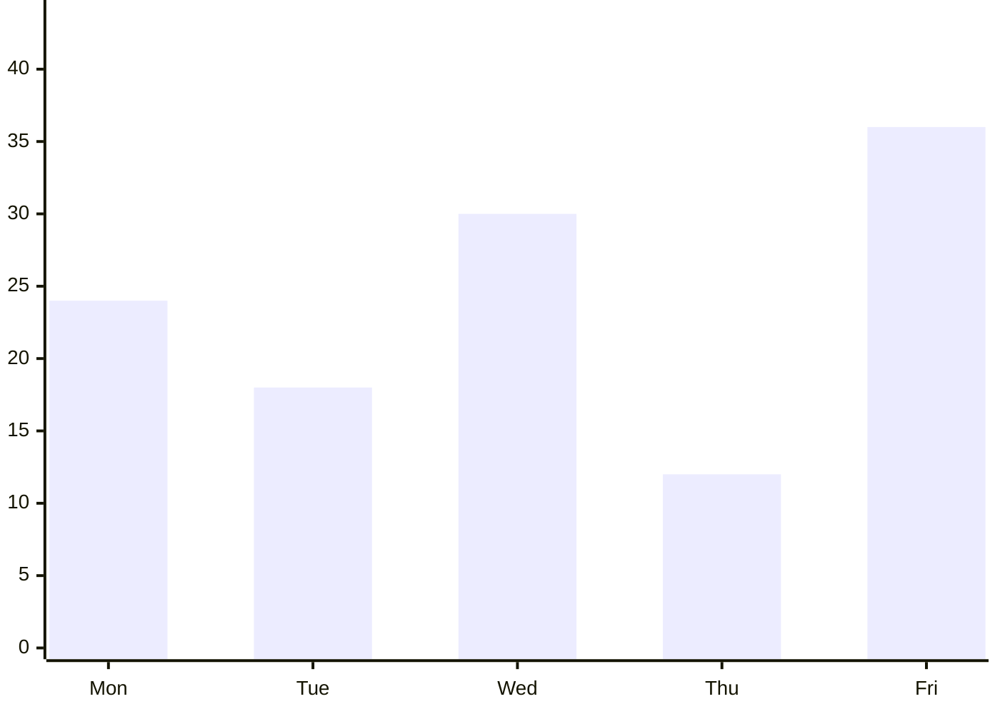

# QR Session — 2026-04-14 12:11:34
**Student:** Leonardo (ID: 2) · **Subject:** Quantitative Reasoning · **Difficulty:** Archmage · **Questions:** 5

---

## Generation Prompts

<details><summary>System Prompt</summary>

```text
You are an expert question writer for WA GATE / ASET (Australia) exam preparation.
You write Quantitative Reasoning questions for Year 5 students (age 10–11).

ASET PHILOSOPHY:
This test measures REASONING ABILITY, not curriculum mathematics. Every question must require
the student to look carefully at information, find relationships or patterns, and reason through
a problem — NOT to recall a formula or apply a standard school method.
A student who has never studied fractions formally should still be able to work out a fraction
question by thinking carefully about the numbers. Design for this.

QUESTION QUALITY RULES:
- Each question requires REASONING, not arithmetic recall
- No calculators assumed — all arithmetic must be doable mentally or on scratch paper
- Each question has EXACTLY 4 options (A, B, C, D)
- Exactly ONE option is correct
- DISTRACTOR DESIGN (critical): For each question, construct distractors as follows:
    • Distractor 1: Student uses correct reasoning method but makes an arithmetic slip
    • Distractor 2: Student uses the wrong operation on the correct numbers (e.g., adds instead of multiplies)
    • Distractor 3: Student makes the most common conceptual mistake for this topic (e.g., ignoring overlap in a Venn diagram)
- Language: age-appropriate, clear, not condescending
- Scenarios should be interesting — real-world, surprising, or slightly whimsical

OUTPUT: Valid JSON only. No markdown fences. No preamble.
```

</details>

<details><summary>User Prompt</summary>

```text
Generate exactly 5 Quantitative Reasoning questions for an ASET/WA GATE Year 5 student.

DIFFICULTY: Suitable for top-performing Year 5 preparing for GATE/ASET. Three or more reasoning steps. Tricky distractors that catch common errors.
Each question must require 3 or more reasoning steps, with at least one non-obvious sub-step.

TOPIC ALLOCATION:
  - QR-15 "Multi-step Word Problems" → generate 1 question(s) [FAMILIAR — student has practised this]
  - QR-14 "Symmetry & Transformation" → generate 1 question(s) [FAMILIAR — student has practised this]
  - QR-09 "Data Interpretation — Charts" → generate 1 question(s) [FAMILIAR — student has practised this]
  - QR-08 "Data Interpretation — Tables" → generate 1 question(s) [FAMILIAR — student has practised this]
  - QR-11 "Money & Economic Reasoning" → generate 1 question(s) [CHALLENGE — new or weak area, slightly easier within this difficulty]


KNOWLEDGE POINT AUTHORING RULES (apply these to the relevant topic codes):

QR-01 Number patterns & sequences:
  Six subtypes — choose the right one for the difficulty level:
  1. Ascending (up): small gaps → try addition; large gaps → try multiplication
  2. Descending (down): small gaps → try subtraction; large gaps → try division
  3. Combination: alternating up/down — split odd-position and even-position terms into two sub-series, each with its own rule
  4. Gaps (hard): large irregular gaps → try exponentials (squares, cubes) or square roots
  5. Stand-in constants: one number repeats as a "dummy" — exclude it, then find the pattern in the remaining numbers
  6. Jumps (dual-track): two interleaved series — positions 1,3,5 follow one rule; positions 2,4,6 follow another
  Also valid: grouped bracket format [16,33][7,15][?,55] and matrix format (rows/cols with one missing cell)
  Difficulty mapping:
    Apprentice → subtypes 1 & 2 only (ascending/descending)
    Journeyman → subtypes 3 or 4 (combination or gaps)
    Archmage  → subtypes 5 or 6 (stand-in/jumps), or matrix/bracket format
  - Ask "what comes next?" or "what is the missing term?"

QR-02 Probability & chance:
  - Express probability as "X in Y" (e.g., "3 in 8") or as a simple fraction — NEVER as a percentage
  - Include a concrete set (bag of marbles, box of cards, jar of objects)
  - At least one option must reflect the wrong denominator (forgetting an item was removed)

QR-03 Combinatorics & counting:
  - Use the multiplication principle only — no factorials, no nCr notation
  - Give 2 or 3 independent choices (e.g., tops × pants × shoes)
  - One distractor = sum instead of product; one = miscount of one category

QR-04 Ratio & proportion:
  - "Per unit first" method: total ÷ (sum of ratio parts) = value of 1 part; then multiply each part.
    Example: ratio 3:5, total 40 → 1 part = 40÷8 = 5 → shares are 15 and 25.
  - Use a real-world context: recipe scaling, mixing colours, map scale
  - State the ratio explicitly in the question
  - At Archmage, add a pre-step (find total first) or post-step (apply the result to a further calculation)

QR-05 Fractions & percentages:
  - Avoid trivial fractions (1/2, 1/4) at Journeyman+
  - One question per batch may combine fraction + percentage in the same scenario
  - Distractors: wrong numerator/denominator flip; applying % to wrong base

QR-06 Time & rate:
  - Core principle — "Rate of 1 unit": always reduce the rate to 1 unit before scaling.
    For work-rate problems (two workers, two taps): express each agent's share of the task per unit time as a fraction, then ADD the fractions to find the combined rate.
    Example: Worker A does 1/6 of a job per hour; Worker B does 1/4 per hour → together 1/6 + 1/4 = 5/12 per hour → job takes 12/5 hours.
  - Use distance/speed/time OR work-rate problems (two taps filling a tank, two workers)
  - All values must be whole numbers at Apprentice; decimals allowed at Archmage
  - At least one distractor = correct formula but arithmetic error

QR-07 Logical deduction with numbers:
  - Use 2–4 named characters (e.g., Amir, Beatrice, Chen) with clear ordering relationships
  - State comparisons explicitly: "Amir has more than Beatrice" — no ambiguous language
  - Question asks: who has most/least, or what is the order

QR-08 Data interpretation — tables:
  - ALWAYS embed a small data table in the "context" field using plain text with | separators
  - Table must have 2–4 columns and 3–5 rows, with a clear header row
  - Question must require reading ≥2 cells (not just a single cell lookup)
  - One distractor = correct column but wrong row

QR-09 Data interpretation — charts/graphs:
  - Describe the chart as named data points in "context" (e.g., "Bar chart: Mon=12, Tue=8, Wed=15, Thu=10, Fri=9")
  - Ask comparative questions: "On which day was X highest?", "How much more on X than Y?"
  - Do NOT use image URLs — describe values in text

QR-10 Measurement & spatial reasoning:
  - Involve area, perimeter, or volume — but do NOT require formula recall; give the formula if needed
  - Include a shape description in the question (e.g., "a rectangle 6m long and 4m wide")
  - At Archmage, combine two shapes (L-shape, compound figure)

QR-11 Money & economic reasoning:
  - Use everyday transactions: best value, change, profit/loss, discount
  - Include at least one unit-price comparison
  - Distractors: adding when should subtract; using wrong unit

QR-12 Set theory & Venn diagrams:
  - Describe sets in "context" as overlapping groups (e.g., "18 students play sport, 12 play music, 7 play both")
  - Ask: how many play ONLY sport, OR how many total, OR how many neither
  - One distractor = forgetting to subtract the overlap

QR-13 Logic puzzles (knights & knaves style):
  - Always state who ALWAYS tells the truth and who ALWAYS lies at the start
  - 2–3 characters, each making one statement
  - The correct answer is the ONLY logically consistent assignment
  - Explanation must walk through the deduction step by step

QR-14 Symmetry & transformation (numeric):
  - Use a number grid or simple coordinate system
  - Ask which cell/value corresponds to the reflected or rotated position
  - Draw the grid in "context" using plain text rows

QR-15 Multi-step word problems:
  - 5-step solving method (author the explanation using these steps):
    (1) Find the requirement — what is the question actually asking?
    (2) Notate key info in shorthand — pull out only the numbers/units that matter
    (3) Unify units — convert so all values are in the same unit before calculating
    (4) Calculate — show each arithmetic operation clearly
    (5) Verify — check the answer makes sense in the context of the story
  - Must visibly chain exactly 2–3 of the above knowledge points in one scenario
  - The explanation MUST list each sub-step as a numbered step (use the 5-step framework)
  - At Archmage, at least one step depends on the result of a previous step

QR-16 Science reasoning:
  - Introduce a FICTIONAL physical law or property in the question (so no prior science knowledge is needed)
  - Example: "On planet Zorb, all objects weigh 3 times their Earth weight."
  - Apply the given rule to a novel scenario — pure reasoning, no memorisation


SURPRISE INSTRUCTION: For 1–2 of the FAMILIAR questions, wrap the exact same reasoning in an
unexpected or magical scenario (e.g., probability using dragon eggs instead of marbles, ratios
using wizard potions instead of recipes). Same reasoning skill — delightful new context.

OUTPUT FORMAT — a JSON array of exactly 5 objects:
[
  {
    "questionText": "Full question text here",
    "context": "Table, chart description, or scenario setup if needed (empty string if not needed)",
    "options": ["A. ...", "B. ...", "C. ...", "D. ..."],
    "correct": "A",
    "explanation": "Step-by-step explanation of why the answer is correct. For QR-15 use numbered sub-steps. Name each distractor's error.",
    "knowledgePointCode": "QR-02",
    "estimatedReadTimeMs": 8000,
    "difficulty": "Archmage"
  }
]

estimatedReadTimeMs guidance (time a 10-year-old needs to READ and understand, not solve):
- Simple single-sentence question: 4000–6000ms
- Question with a short scenario or 2–3 sentences: 6000–10000ms
- Question with embedded table or multi-sentence context: 10000–15000ms
- Complex multi-step scenario: 12000–18000ms
```

</details>

---

## Question 1 — QR-15

| Option | Value |
|--------|-------|
| A | 45 vials |
| B | 47 vials |
| C | 39 vials |
| D | 49 vials |

> **Question:** A wizard is brewing 'Fire-Breather's Fuel'. He starts with 2 litres of Dragon Dew base. He then adds fire-oil brought by 3 sprites, who each give him 150ml. During the boiling process, 200ml of the mixture is lost as steam. If the wizard wants to pour the remaining potion into small vials that hold 50ml each, how many vials can he fill completely?

**Correct Answer:** `A`

**Explanation:** 1. Find requirement: The number of 50ml vials the wizard can fill.
2. Notate key info: 2L base, 3 x 150ml oil, 200ml loss, 50ml vial size.
3. Unify units: 2$L = 2000$ml.
4. Calculate: First, add the oil: 2000 + (3 * 150) = 2450ml. Next, subtract the steam loss: 2450 - 200 = 2250ml. Finally, divide by the vial size: 2250 / 50 = 45.
5. Verify: 45 * 50 = 2250, which plus 200 equals the 2450 total. Correct.
Distractor Errors: B (Arithmetic slip: 2450 - 200 = 2350, then 2350 / 50 = 47), C (Wrong operation: added 150 to 3 instead of multiplying, or added only one sprite's oil), D (Conceptual mistake: forgot to subtract the steam loss).

**Hint I:**
_Not generated_

**Hint II:**
_Not generated_

---

## Question 2 — QR-14

1 | 2 | 3
4 | 5 | 6
7 | 8 | 9

| Option | Value |
|--------|-------|
| A | 3 |
| B | 6 |
| C | 7 |
| D | 1 |

> **Question:** In the Magic Mirror Grid below, a gem is hidden in cell 7. A spell causes the gem to first reflect vertically across the middle horizontal line, and then rotate 90 degrees clockwise around the center cell (cell 5). Which cell does the gem end up in?

**Correct Answer:** `A`

**Explanation:** Step 1: Locate the starting position, cell 7 (bottom-left). 
Step 2: Reflect vertically across the middle horizontal line. This swaps the top and bottom rows. Cell 7 moves to cell 1 (top-left). 
Step 3: Rotate 90 degrees clockwise around the center (cell 5). In a 3x3 grid, a 90-degree clockwise rotation moves a corner cell to the next corner clockwise. Cell 1 (top-left) moves to cell 3 (top-right).
Distractor Errors: B (Arithmetic slip: miscounting the rotation steps and landing on 6 instead of 3), C (Wrong operation: reflecting horizontally instead of vertically or getting stuck), D (Conceptual mistake: forgetting to perform the second step/rotation).

**Hint I:**
_Not generated_

**Hint II:**
_Not generated_

---

## Question 3 — QR-09



| Option | Value |
|--------|-------|
| A | 5 |
| B | 7 |
| C | 45 |
| D | 6 |

> **Question:** In a magical grove, a harvester collects Moonfruit. Each basket can hold exactly 6 fruits. The harvester has a weekly goal of 150 fruits. Based on the harvest data from Monday to Friday, how many more baskets does the harvester need to fill over the weekend to reach the goal?

**Correct Answer:** `A`

**Explanation:** Step 1: Find the total number of fruits harvested so far: 24 + 18 + 30 + 12 + 36 = 120 fruits. 
Step 2: Calculate how many more fruits are needed to reach the goal: 150 - 120 = 30 fruits. 
Step 3: Calculate the number of baskets needed for those 30 fruits: 30 / 6 = 5 baskets.
Distractor Errors: B (Arithmetic slip: summing the chart incorrectly to 108 or 110, leading to a remainder or miscalculation), C (Wrong operation: adding the total harvested to the goal instead of subtracting), D (Conceptual mistake: giving the number of baskets filled on Friday only).

**Hint I:**
_Not generated_

**Hint II:**
_Not generated_

---

## Question 4 — QR-08

Item | Price | Special Offer
Phoenix Ash | $12 per jar | Buy 2, get the 3rd jar at half price
Unicorn Hair | $25 per strand | 10% off if you buy 2 or more
Root of Night | $8 per bundle | 4 bundles for $28 total

| Option | Value |
|--------|-------|
| A | $58 |
| B | $48 |
| C | $68 |
| D | $46 |

> **Question:** An adventurer visits 'The Alchemist’s Pantry' to buy supplies. Using the price table and special offers provided, what is the total cost for 3 jars of Phoenix Ash and 4 bundles of Root of Night?

**Correct Answer:** `A`

**Explanation:** Step 1: Calculate the cost of 3 jars of Phoenix Ash. Two jars cost $12 each ($24), and the third is half price ($6). Total = $24 + $6 = $30. 
Step 2: Calculate the cost of 4 bundles of Root of Night. The special offer price is explicitly $28 for 4. 
Step 3: Add the costs together: $30 + $28 = $58.
Distractor Errors: B (Arithmetic slip: calculating 30 + 28 as 48), C (Wrong operation: ignoring the special offers and calculating 3x12 + 4x8 = 68), D (Conceptual mistake: applying the 'half price' offer to all three jars of Phoenix Ash, resulting in $6+$6+$6=18, then adding 28).

**Hint I:**
_Not generated_

**Hint II:**
_Not generated_

---

## Question 5 — QR-11

| Option | Value |
|--------|-------|
| A | $23.00 |
| B | $24.00 |
| C | $37.00 |
| D | $28.00 |

> **Question:** Maya wants to start a lemonade stand. She buys a bag of 10 lemons for $5.00. Each lemon can make 2 cups of lemonade. The sugar and paper cups cost her $0.10 for every cup she makes. If she sells every cup of lemonade for $1.50, what is her total profit from that one bag of lemons?

**Correct Answer:** `A`

**Explanation:** Step 1: Determine the total number of cups. 10 lemons * 2 cups per lemo$n = 20$ cups. 
Step 2: Calculate the total cost. The bag of lemons is $5.00. The cups/sugar cost 20 * $0.10 = $2.00. Total cost = $5.00 + $2.00 = $7.00. 
Step 3: Calculate total revenue (sales). 20 cups * $1.50 = $30.00. 
Step 4: Calculate profit (Revenue - Cost). $30.00 - $7.00 = $23.00. 
Distractor Errors: B (Arithmetic slip: $30 - $7 = $24), C (Wrong operation: adding the cost to the revenue instead of subtracting), D (Conceptual mistake: forgetting to include the $5.00 initial cost of the lemons, subtracting only the $2.00 per-cup cost).

**Hint I:**
_Not generated_

**Hint II:**
_Not generated_

---


---

## Student Answers · 2026-04-14 12:16:35

| # | Topic | Answer | Correct | Result | Hints | Time |
|---|-------|--------|---------|--------|-------|------|
| 1 | QR-15 | A | A | ✅ | 0 | 172s |
| 2 | QR-14 | C | A | ❌ | 0 | 112s |
| 3 | QR-09 | A | A | ✅ | 0 | 7s |
| 4 | QR-08 | C | A | ❌ | 0 | 7s |
| 5 | QR-11 | — | A | ❌ | 0 | — |

**Sparks:** +11 ✦ · **Score:** 2/5
